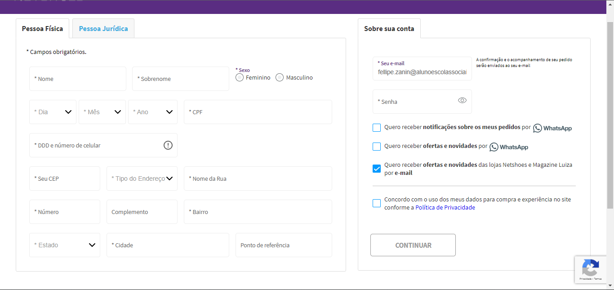

# Formulário de Cadastro 

Formulário produzido a partir do [Bootstrap 5](https://getbootstrap.com/), a partir da análise de 3 sites onde retiramos as informações ultilizadas em nosso formulário de Cadastro.

## Índice 
* [Descrição](#descrição)
* [Introdução](#introdução)
* [Funcionalidades](#funcionalidades)
* [Técnicas e tecnologias utilizadas](#técnicas-e-tecnologias-utilizadas)
* [Sites consultados](#Sites-consultados)

## descrição

o site contem os seguintes passos para a formação do cadastro:

Pessoais:

* Contendo informações como email, senha, data de nascimento, telefone, cpf, nome.

* ultilizados apenas para uma melhor experiência durante anavegação no site, também ajudando
o vendedor a identificar o comprador.

Endereço:

* Parte essêncial para que o vendedor possa saber o destino para onde o produto será levado.

* nesse campo são pedidos os seguintes critérios: 

* `` Endereço, Bairro, Cidade, Estado, Cep ``

## Introdução 
Passo a passo para o cadasto:

- Preencha os campos dos dados pessoais.
- Cadastre um endereço.
- Clique no botão "Salvar".

Dicas para criar uma senha:
- Sua senha deve ter pelo menos 8 caracteres.
- Sua senha deve conter letras maiúsculas e minúsculas, números e símbolos.
- Não use senhas que sejam fáceis de adivinhar, como seu nome, data de nascimento ou endereço.

## Funcionalidades
**Dados pessoal**

campos:

* **Nome:** Nome completo do usuário.
* **CPF:** O Cadastro de Pessoa Física do usuário.
* **Telefone:** Número de celular do usuário.
* **Data de nascimento:** Data de nascimento do usuário.
* **Email:** Email do usuário.
* **Senha:** Senha criada pelo usuário.

**Cadastro de endereço**

 campos:

* **Bairro:** Bairro do destinatário.
* **Endereço:** Endereço do destinatário.
* **Cidade:** Cidade do destinatário.
* **Estado:** Estado do destinatário.
* **CEP:** CEP do destinatário.

## Técnicas e tecnologias utilizadas
* [<code></code>](https://developer.mozilla.org/pt-BR/docs/Web/HTML)
* [<code></code>](https://getbootstrap.com/docs/5.0/getting-started/introduction/)
* [<code></code>](https://git-scm.com/)
* [<code></code>](https://code.visualstudio.com/)
* [<code></code>](https://github.com/)

# Sites consultados

## Shopee:
**Descrição dos campos**
- Para iniciar o cadastro, é preciso fornecer um número de celular, e-mail ou usar o Facebook como opções de registro. Na captura de tela que escolhi para o trabalho, optei por usar o número de celular. Posteriormente, recebi um código de verificação no WhatsApp. Em seguida, tive que criar uma senha com requisitos específicos: pelo menos um caractere minúsculo, um caractere maiúsculo e um comprimento de 8 a 16 caracteres, permitindo apenas letras, números e pontuação.

- Após concluir o registro, na primeira compra, foi necessário fornecer informações de endereço. Solicitaram meu nome completo, um número de contato opcional, e o CEP, que foi usado para acelerar o preenchimento. Se o CEP fosse inserido corretamente, o site buscaria automaticamente o estado, cidade, bairro e rua. No entanto, o número do local precisava ser inserido manualmente caso o CEP fosse inserido incorretamente ou não fosse inserido. Além disso, era necessário especificar se o endereço era de um apartamento ou casa.

- Finalmente, foi necessário preencher um cadastro pessoal, incluindo data de nascimento, e-mail, nome completo, gênero e CPF.

## AliExpress:
**Descrição dos campos** 
- O cadastro começou com a solicitação da localização do usuário, e-mail e senha. Em seguida, foi enviado um código de 4 dígitos para verificar o e-mail. Depois, foi necessário inserir um CPF válido, com a restrição de que não poderia ser de um menor de idade. Após inserir o CPF, o cadastro estava concluído, mas também foi solicitado o DDD e número de telefone.

- Na primeira compra, foi necessário fornecer informações de endereço para entrega. Isso incluiu o nome de contato do usuário, um número de celular para contato, o CEP, que agilizaria o processo de preenchimento. Se o CEP estivesse correto, o site preencheria automaticamente o estado, cidade, bairro, rua e número da residência. Caso o CEP estivesse incorreto, o usuário teria que inserir essas informações manualmente. Além disso, foi necessário indicar se o local de entrega era um apartamento ou casa. Novamente, o site solicitou o CPF.

## Netshoes:
**Descrição dos campos** 
- O site da Netshoes se destacou por ter um processo de cadastro simples e único, eliminando a necessidade de fornecer informações de endereço durante a primeira compra. Existiam dois tipos de cadastros: um para pessoa física e outro para pessoa jurídica.

- Para o cadastro de pessoa física, eram solicitados nome completo, data de nascimento, CPF, DDD e número de celular. No cadastro de pessoa jurídica, era necessário fornecer Razão Social, Nome Fantasia e CNPJ da empresa. A Inscrição Social não era obrigatória, mas a Inscrição Estadual era necessária. Também havia campos para DDD e número de celular corporativo e DDD e número de telefone fixo corporativo, este último sendo opcional.

- O cadastro de endereço era semelhante para ambos os tipos de cadastro, requerendo o fornecimento do CEP (com preenchimento automático dos campos se o CEP fosse inserido corretamente). Além disso, era necessário especificar o tipo de endereço (casa, condomínio, etc.), nome da rua, número, bairro, estado e cidade. Os usuários tinham a opção de adicionar complementos e ponto de referência, se desejado.

## Autor
| [ Fellipe Gabriel Zanin](https://github.com/Fell1pe) |
| :---: |
